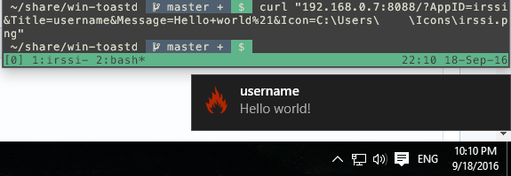

# toastd - A networked toast daemon for Windows.

toastd lets Windows 10 users receive notifications from another machine. It was designed to work with virtual machine guests, so external IP addresses are ignored by default.

This application listens for requests on a port (default: 8092)
with the following optional query parameters:
  * app:       The name of the application. Toasts are grouped by app in the notification center.
  * title:     The title of the toast.
  * msg:       The message body.
  * icon:      Path to an icon on your Windows system.

Encode the following reserved characters in your query parameters.

| Desired Character |  URL Encoding  | Output |
|:-----------------:|:--------------:|:------:|
| space             | + or %20       |   ` `  |
| +                 | %2b            |   `+`  |
| &                 | %26            |  `and` |
| "                 | \"             |   `"`  |

##Example request:

  ```bash
  curl "192.168.0.5:8092/?app=irssi&title=username&msg=hey+what's+up?&icon=C:\Users\Username\Icons\irssi.png"
  ```

  
##Configuration flags:

  `-port PORTNUMBER`      Changes the listening port.         ex: `win-toastd -port 8082`

  `-allow-external`      Allows requests from external IPs.  ex: `win-toastd -allow-external`

**Warning: Only use -allow-external with a well-configured firewall.**
